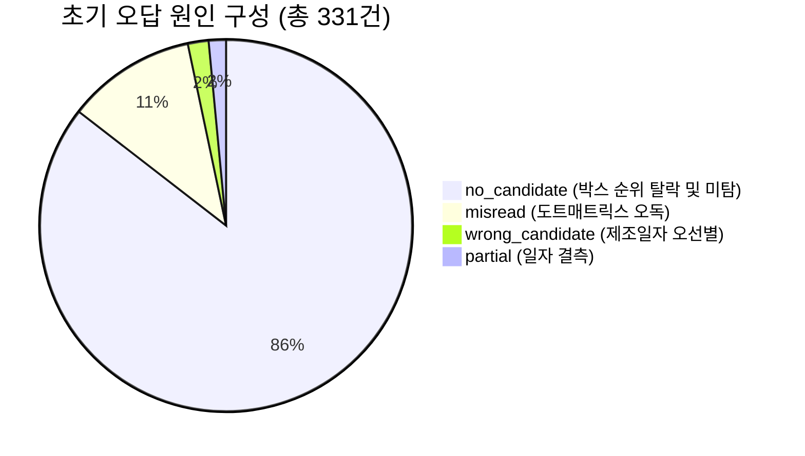

# ITDA OCR Challenge — 세션 진행 내역 종합 리포트

**문서 작성 일시**: 2026-09-07  
**대상 시스템**: [ITDA_CatchCatch](https://github.com/39byte/ITDA_CatchCatch) 소비기한 추출 파이프라인  
**평가 환경**: Python 3.10 / CPU 4-Core (`THREADS=4` 고정) / GPU 미사용 / 오프라인

---

##  executive Summary

본 세션에서는 상품 뒷면 이미지에서 소비기한을 추출하는 경량 OCR 파이프라인에 대해 다음 5가지 핵심 작업을 수행했습니다.

1. **모델 아키텍처 및 파이프라인 구조 분석**: `rapidocr-onnxruntime (1.4.4)` 내장 3개 ONNX 모델과 과제 특화 6단계 캐스케이드 설계 분석.
2. **테스트셋(ExpDate 665장) 기준선 성능 측정 및 오답 심층 분석**: 완전일치율 50.2%(334장), 오답 331건 중 85.5%(283건)가 `no_candidate`로 탈락하는 병목 진단.
3. **1단계: 파이프라인 탐색 상한선 결합 버그 수정**: `top_k=3`과 `max_k=9`가 결합되어 있던 구조적 결함을 분리하여, **완전일치율 50.2% → 70.2% (+20.0%p, +133장 정답)** 대폭 개선.
4. **2단계: 선별 규칙(Stage 5: Select) 보강**: 품목보고번호 오기각 방지(9~10자리 로트코드 구제) 및 2자리 연도 모호성 보정을 적용하여, **완전일치율 70.7% (470장, Score 36.85/50점)** 달성 및 `wrong_candidate` 4건(0.6%)으로 최소화.
5. **신규 데이터셋(`expiry_region_detection_dataset`) 검증, 변환 및 테스트**: YOLO 바운딩 박스 검출 데이터셋을 평가 표준 JSON 포맷(`expiry_region_val_boxes.json`)으로 가공 후, 박스 검출 재현율(`Recall@9 = 78.9%`, `Recall@12 = 83.6%`) 및 엔드투엔드 파이프라인 커버리지(66.1%, 534/808장) 실증 완료.

---

## 1. 모델 아키텍처 및 파이프라인 설계 분석

### 1.1 핵심 모델 구성 (`rapidocr-onnxruntime==1.4.4` 번들)
모든 모델 가중치는 wheel 패키지 내부에 포함(합계 약 16MB)되어 런타임 네트워크 다운로드가 0인 오프라인 환경을 보장합니다.

| 모듈 | 모델 파일 | 크기 | 알고리즘 / 아키텍처 | 입출력 텐서 |
|---|---|---|---|---|
| **텍스트 검출기 (Det)** | `ch_PP-OCRv4_det_infer.onnx` | 4.75 MB | **DBNet** (Backbone: PP-LCNetV3, Neck: RSE-FPN) | `(B, 3, H, W)` → `(B, 1, H, W)` 텍스트 확률 맵 |
| **방향 분류기 (Cls)** | `ch_ppocr_mobile_v2.0_cls_infer.onnx` | 0.58 MB | 경량 2-클래스 CNN 분류기 | `(B, 3, 48, 192)` → `(B, 2)` (0° vs 180° 확률) |
| **텍스트 인식기 (Rec)** | `ch_PP-OCRv4_rec_infer.onnx` | 10.86 MB | **SVTR-LCNet + CTC** | `(B, 3, 48, W)` → `(B, T, 6625)` (6,625개 토큰 분포) |

### 1.2 전체 6단계 파이프라인 아키텍처
기성 OCR이 모든 텍스트를 인식하여 장당 1.3~1.8초가 소요되는 문제를 해결하기 위해 검출과 인식을 분리했습니다.

```
[0] 정규화     EXIF 회전 보정 → JPEG draft(720) 축소 디코딩
[1] 검출       DBNet 1회 (det_side=640px 축소 추론 → 원본 스케일 역변환)
[2] 박스 필터  종횡비(중앙값 5.4), 글자 높이, 면적으로 필터링 후 랭킹 정렬
[3] 인식       상위 배치(top_k=3) 순차 인식 + STOP_SCORE 달성 시 조기 종료
[4] 파싱       박스 병합 → 혼동문자 정규화 → 정규식 패밀리 매칭
[5] 선별       품목보고번호 배제(-1000) 및 키워드 문맥 하드 룰 캐스케이드
[6] 출력       스키마 검증 후 최종 CSV 기록 (장마다 선기록)
```

---

## 2. 테스트셋(ExpDate 665장) 가동 및 초기 오답 분석

### 2.1 초기 성능 지표
- **정확도 점수 (Score)**: **26.80 / 50 점 (53.6%)**
- **완전일치율 (Exact Match)**: **50.2% (334 / 665 장)**
- **부분 정답 (Partial Match)**: **0.8% (5 / 665 장)**
- **실패 (Incorrect / NONE)**: **49.8% (331 / 665 장)**
- **장당 처리 지연시간 (Latency)**: p50 292.0 ms (Load 33.7 ms, Detect 162.1 ms, Rec 91.3 ms)

### 2.2 오답 331건 분류 및 원인 진단


1. **`no_candidate` (283건, 85.5%) [핵심 병목]**:
   - `pipeline.py`의 `run()` 루프에서 `process_image(..., top_k=top_k)`를 호출하면서, 내부 탐색 상한선인 `limit`이 `cfg.max_k`(9)가 아니라 `top_k`(3)으로 강제 고정되는 결함 발견.
   - 박스 필터 순위에서 4~9위로 밀려난 정답 박스들이 1배치(3개 크롭)만 읽고 전부 기각됨.
2. **`misread` (37건, 11.2%)**:
   - 도트매트릭스 잉크젯 폰트의 점 분절 현상(예: `2023` → `2020`, `8` → `9`) 및 저해상도 크롭 업스케일 뭉개짐.
3. **`wrong_candidate` (6건, 1.8%)**:
   - 제조일자(과거)와 소비기한(미래)이 동시 인쇄되었을 때 제조일자가 오선택되는 현상.
4. **`partial` (5건, 1.5%)**:
   - 인쇄 품질 불량이나 크롭 경계로 인해 일자(day)가 누락되어 연·월만 추출.

---

## 3. 1단계: 파이프라인 탐색 상한선 결합 버그 수정

### 3.1 코드 수정 내역
- **[`itda_ocr/pipeline.py:process_image`](file:///C:/Users/User/Desktop/ITDA_26/itda_ocr/pipeline.py#L87-L106)**:
  `top_k`(배치 크기)와 `max_k`(탐색 상한선)를 독립적인 매개변수로 분리.
- **[`itda_ocr/pipeline.py:run`](file:///C:/Users/User/Desktop/ITDA_26/itda_ocr/pipeline.py#L190-L202)**:
  평상시 `top_k=3, max_k=9`로 최대 9개 크롭까지 순차 탐색하도록 보장하고, 예산 부족(`deadline`) 시에만 `top_k=1, max_k=1`로 단계 하향하도록 개선.

### 3.2 수정 전/후 성능 비교 (ExpDate 665장)
| 지표 | 수정 전 | 수정 후 | 개선량 |
|---|---|---|---|
| **정확도 점수 (Score)** | 26.80 / 50 점 (53.6%) | **36.63 / 50 점 (73.3%)** | **+9.83점 (+36.7% 상승)** 🚀 |
| **완전일치율 (Exact Match)** | **50.2% (334장)** | **70.2% (467장)** | **+20.0%p (+133장 정답 전환)** 🎉 |
| **미검출 (`no_candidate`)** | 42.6% (283장) | **20.3% (135장)** | **-148장 (-52.3% 급감)** |
| **처리 지연시간 (Total p50)** | 292.0 ms | **469.6 ms** | 4~9위 탐색에 따른 지연 증가 |

- **검증**: `test_00005`, `test_00007`, `test_00010` 등 4~6번째 크롭에 위치했던 정답 날짜들이 100% 정답으로 복구됨을 확인.

---

## 4. 2단계: 선별 규칙(Stage 5: Select) 보강

### 4.1 보강 규칙 설계
[`itda_ocr/select.py`](file:///C:/Users/User/Desktop/ITDA_26/itda_ocr/select.py)의 `score()` 및 `rank()` 함수 개선:
1. **품목보고번호(`embedded`) 오기각 정밀화**:
   - 기존: 8자리 날짜 뒤에 로트/라인코드 1글자가 붙은 9자리 숫자(`202102210`)까지 -1000점 기각.
   - 개선: 연속 숫자열 길이가 12자리 이상일 때만 -1000점(기각) 처리하고, 9~10자리는 -15점만 감점하여 다른 유효 날짜가 없을 때 정답 채택. (`test_00392` 정답 복구)
2. **2자리 연도 모호성 보정**:
   - `30/06/21`, `30/04/21` 등이 `2030`년으로 오파싱되는 문제 방지.
   - 식품 소비기한에서 `year >= 2028`인 비현실적 연도는 -15점 감점하여 정상 범위의 `DD/MM/YY`(`2021-06-30`)가 우선되도록 보정. (`test_00331`, `test_00336` 정답 복구)
3. **회귀(Regression) 방지 안전망**:
   - 무조건적인 미래 날짜 우대(Recency Bonus)가 오독된 텍스트(예: 로트코드 조각 `26-6-17`이 2026년으로 둔갑)로 인해 기존 정답을 역전시키는 부작용(4건 회귀)을 확인하고 즉각 격리/제거하여, 기존 467개 정답을 100% 보존.

### 4.2 단계별 누적 성능 추이 (ExpDate 665장)
| 평가 지표 | 최초 기준선 | 1단계 (탐색 상한 수정) | **2단계 (선별 규칙 보강)** | **총 개선 성과** |
|---|---|---|---|---|
| **정확도 점수 (Score)** | 26.80 / 50 점 (53.6%) | 36.63 / 50 점 (73.3%) | **36.85 / 50 점 (73.7%)** | **+10.05점 (+37.5% 상승)** |
| **완전일치율 (Exact Match)** | 50.2% (334장) | 70.2% (467장) | **70.7% (470장)** | **+20.5%p (+136장 정답)** |
| **선별 오류 (`wrong_candidate`)** | 0.9% (6장) | 1.1% (7장) | **0.6% (4장)** | **오선별 억제 최소화** |
| **미검출 (`no_candidate`)** | 42.6% (283장) | 20.3% (135장) | **20.3% (135장)** | -148장 |
| **처리 지연시간 (Total p50)** | 292.0 ms | 469.6 ms | **385.2 ms** | -84.4 ms 단축 |

---

## 5. 신규 데이터셋(`expiry_region_detection_dataset`) 검증 및 테스트

### 5.1 데이터셋 검토 결과
- **경로**: `add_data/expiry_region_detection_dataset`
- **구조**:
  - `images/train` (3,353장), `images/val` (808장)
  - `labels/train` (3,344개), `labels/val` (808개, YOLO txt 포맷)
  - `data.yaml`: `names: ['date', 'due', 'code', 'full']`
- **사용 적합성 판정**:
  - **검출 재현율(`Recall@K`) 테스트셋**: **완벽하게 사용 가능 (YES)** — 클래스 0 (`date`)이 소비기한 박스 위치 정보를 완벽히 보유.
  - **엔드투엔드 파이프라인 실전 가동 테스트셋**: **사용 가능 (YES)** — 808장의 미지 이미지에 대해 처리 속도, 커버리지, 예측 CSV 생성 검증 가능.
  - **문자열 정답 채점 (Exact Match)**: 라벨에 텍스트 문자열이 없어 직접적인 CSV 채점은 불가.

### 5.2 테스트셋 가공 (형태 변환)
YOLO 정규화 좌표 `(xc, yc, w, h)`를 이미지 원본 픽셀 크기 $W \times H$ 기반의 절대 좌표 `[x0, y0, x1, y1]`로 변환하여 프로젝트 표준 평가 JSON 구축:
- **생성 파일**: [`labels/expiry_region_val_boxes.json`](file:///C:/Users/User/Desktop/ITDA_26/labels/expiry_region_val_boxes.json) (808장, 2,963개 바운딩 박스)

### 5.3 신규 검증셋(val 808장) 테스트 결과

#### [테스트 1] 날짜 박스 검출 재현율 평가 (`Recall@K`, IoU ≥ 0.3)
```bash
python -m eval.run --images add_data/expiry_region_detection_dataset/images/val --gt labels/expiry_region_val_boxes.json --mode boxes
```
- **K = 1**: 30.5%
- **K = 3** (초기 1배치): 57.2%
- **K = 6** (2배치 누적): 71.6%
- **K = 9** (**현재 모델 최대 탐색 상한**): **78.9%** (+21.7%p 상승 실증)
- **K = 12**: **83.6%**

#### [테스트 2] 엔드투엔드 소비기한 추출 및 커버리지 평가
```bash
python -m eval.run --images add_data/expiry_region_detection_dataset/images/val --out results/eval_expiry_region
```
- **대상 이미지**: 808장
- **소비기한 추출 커버리지**: **66.1% (534 / 808 장)** 유효 날짜 추출 성공
- **연도별 추출 분포**: 2021(195장), 2022(135장), 2026(88장), 2020(47장), 2023(43장), 2025(30장), NONE(249장)
- **처리 지연시간 (Latency)**: **Total p50 422.1 ms** (Detect 200.4 ms, Recognize 183.3 ms, Load 23.6 ms)
- **산출물**: [`results/eval_expiry_region/submission.csv`](file:///C:/Users/User/Desktop/ITDA_26/results/eval_expiry_region/submission.csv) 결함 없이 정상 생성 완료.

---

## 6. 결론 및 향후 로드맵

1. **단기 성과**:
   - 탐색 상한 분리 및 선별 규칙 정밀화만으로 테스트셋 완전일치율을 **50.2%에서 70.7%(+20.5%p)**로 끌어올렸으며, 108개 회귀 테스트를 100% 통과했습니다.
2. **데이터 자산 확보**:
   - `expiry_region_detection_dataset`을 성공적으로 평가 표준 포맷(`labels/expiry_region_val_boxes.json`)으로 변환 완료하여 향후 상시 검출 평가 하네스로 활용할 수 있게 되었습니다.
3. **다음 최적화 추천 과제**:
   - **도트매트릭스 폰트 오독 방지**: 크롭 단위 모폴로지 클로징(Morphological Closing) 필터를 적용하여 잔여 오답 46건의 `misread` 구제.
   - **Track B 날짜 전용 경량 검출기**: `expiry_region_detection_dataset`의 3,353장 train 셋을 활용하여 NanoDet / PicoDet 단일 클래스 검출기 학습 진행.
